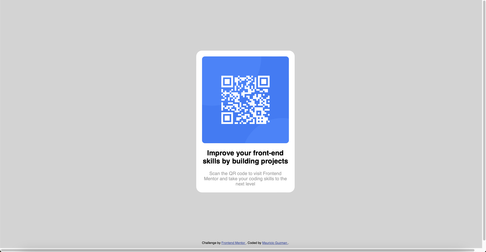

# Frontend Mentor - QR code component solution

This is a solution to the [QR code component challenge on Frontend Mentor](https://www.frontendmentor.io/challenges/qr-code-component-iux_sIO_H). Frontend Mentor challenges help you improve your coding skills by building realistic projects.

## Table of contents

- [Overview](#overview)
  - [Screenshot](#screenshot)
  - [Links](#links)
- [My process](#my-process)
  - [Built with](#built-with)
  - [What I learned](#what-i-learned)
  - [Continued development](#continued-development)
  - [Useful resources](#useful-resources)
- [Author](#author)

## Overview

### Screenshot

### Links

- Live Site URL: [Add live site URL here](https://mgs96.github.io/frontend-mentor-qrcode/)

## My process

### Built with

- Semantic HTML5 markup
- CSS
- Flexbox

### What I learned

I think my biggest learning on this project was that margins collapse, I still don't quite understand why, I used flexbox to correct this behavior, I also had to use min-height property to control the size of the QR container.

### Continued development

I still need to learn and practice more CSS, this is what will enable me to become a proper full stack developer.

### Useful resources

- [Collapsing margins by W3C](https://www.w3.org/TR/CSS21/box.html#collapsing-margins)
- [Collapsing margins by sitepoint](https://www.sitepoint.com/collapsing-margins/)

These two articles helped me understand a little bit why this happens, still, more learning needs to be done.

## Author

- Frontend Mentor - [@mgs96](https://www.frontendmentor.io/profile/mgs96)
